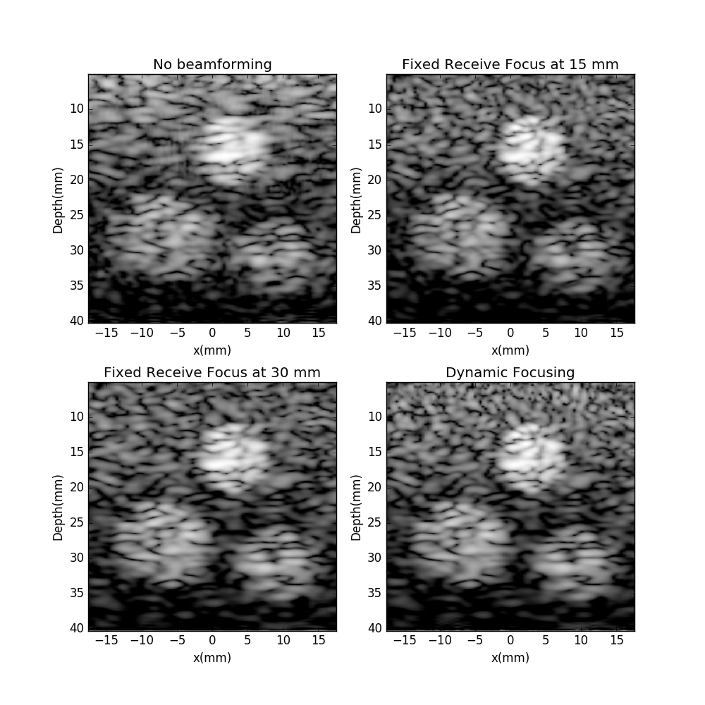

This is an example of ultrasound beamforming using a linear array in Python. RF Data was simulated using a 3rd party MATLAB toolbox called K-Wave created by Bradley Treeby, Ben Cox, and Jiri Jaros. Specifically, the data was generated using the program example_us_bmode_linear_transducer.m, which sets up a linear probe and generates the signals received after pulsing into a 3D scattering phantom. The phantom accounts for nonlinearity, multiple scattering, power law acoustic absorption, and a finite beam width in the elevation direction.

This program requires numpy, scipy, matplotlib, and h5py.

example_us_bmode_linear_transducer.m not only simulates recorded data but performs image reconstruction as well. However, I have merely acquired the raw RF data stored in the variable 'sensor_data' and written my own image reconstruction routines with an educational emphasis. The conventional steps in an ultrasound signal processing pipeline are conducted, and a comparison is performed between simple B-mode imaging, beamforming with fixed receive focus, and dynamic focusing. 

One can find the nature of the simulated data as well as a description of the K-wave program here: 

http://www.k-wave.org/documentation/example_us_bmode_linear_transducer.php

